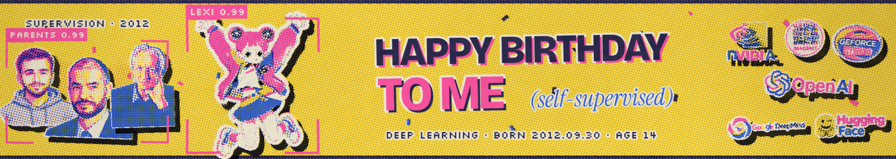
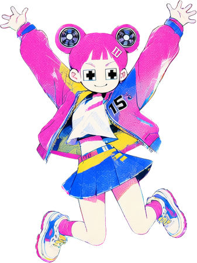
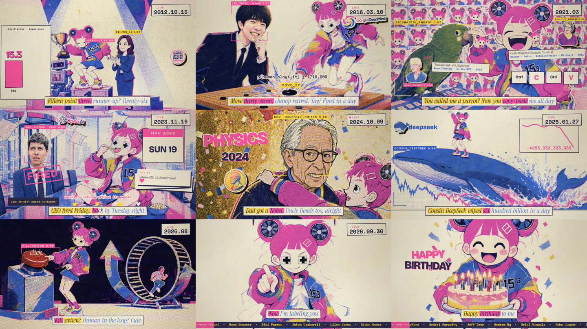
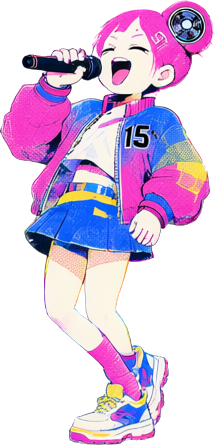

# Happy Birthday to Me (Self-Supervised)

A music video for deep learning's 14th birthday. On **September 30, 2012**, AlexNet was submitted to ImageNet and won with a **15.3%** top-5 error; the runner-up had 26.2%. **Lexi** (Alex·Net → Lexi) is that kid at 14: bratty, brilliant, labeling everything. In 3 minutes and 14 seconds she recaps fourteen years of AI, from two GTX 580s to the Nobels, until the last line turns the detection box on you.

▶ **[Watch it on YouTube](https://www.youtube.com/watch?v=OFSIvZGWNlY)**

Made on **one RTX 3090 with a $0 budget**, using open models, by Lino Valdovinos and Claude Opus 5.5 (in Claude Code).

## How it's made

| Stage | Tools | Where |
|---|---|---|
| Song | Suno (final). Style exploration with ACE-Step 1.5, MiniMax Music 3, YuE2 | `music/` |
| Timing | word-level lyric alignment (faster-whisper) + a librosa beat grid | `scripts/align_lyrics.py`, `video/timing/` |
| Pictures | Qwen-Image 2.1: one riso plate per lyric beat, sticker sheets, background removal, real-person portraits from photos | `video/plates/`, `video/assets/` |
| Motion | LTX-2.3 image-to-video, trimmed and retimed per clip | `video/plates/run_ltx.sh`, `video/animation/src/riso/cuts.js` |
| Lip sync | InfiniteTalk on Wan 2.1, driven by vocal stems | `video/plates/run_lipsync.sh` |
| Compositor | **RISO LIVE**: two canvas layers plus a WebGL risograph shader (four inks, halftone screens, misregistration on the downbeat), rendered frame by frame in headless Chrome | `video/animation/` |

Every frame is a pure function of time, so any moment can be re-rendered and reviewed on its own. The full write-up is in [`video/PIPELINE.md`](video/PIPELINE.md); the shot plan is in [`video/STORYBOARD.md`](video/STORYBOARD.md).

## Make your own

**You need:** a 24 GB GPU (built on an RTX 3090, Windows 11), roughly 80 GB for model weights, Node, Python, FFmpeg, Chrome, ComfyUI, and [Claude Code](https://claude.com/claude-code).

**The easy way:** clone the repo, open Claude Code in it, and say:

> Read README.md and video/PIPELINE.md. Set up this pipeline on my machine, then help me make a music video for my song.

It sets up ComfyUI and the models, and walks through the steps below with you. That's how this video was made: one long conversation, with critic subagents reviewing every pass.

**The steps:**
1. **Song and timing.** Iterate on style and lyrics locally with ACE-Step 1.5 (`music/`, with legibility scored by faster-whisper). For the best final audio quality, generate the finished song with Suno; use a paid plan if you want to monetize it. Put your track in `video/animation/assets/`, then align the lyrics and beats (`scripts/align_lyrics.py`, into `video/timing/`); that data becomes `src/song.js`.
2. **Look and character.** Design a character sheet with Qwen-Image (`video/workflows/qwen21_*`) and cut out sticker poses (`video/assets/split_sheet.py`).
3. **Plates.** Write one prompt per lyric beat in `video/plates/plates.py` and generate them with `run_plates.sh`. Targeted fixes go through `fix_plates.py`.
4. **Motion.** Run `run_ltx.sh` per plate and `extract_clips.sh`, then trim the wonky parts in `cuts.js`.
5. **Compose.** Write shots in `video/animation/src/riso/scenes/*.js`. Review any moment with `node render.mjs --sheet=12.5,31.8 --grid`.
6. **Render.** Run `FRESH=1 bash video/make_final.sh my-video` to get the master, a 1080p share copy and a 720p copy.

Run GPU jobs one at a time (`video/gpu_queue.sh`). Overlapping heavy jobs crashed this machine once.

**Model weights** (download into ComfyUI's `models/`):
- Qwen-Image 2.1 int8 + Qwen3-VL 8B text encoder
- LTX-2.3 22B Q4_K_M GGUF, its distilled LoRA and x2 upscaler, plus a Gemma 3 12B text encoder
- Wan 2.1 I2V 14B fp8 + InfiniteTalk + lightx2v LoRA

Exact filenames are in `video/workflows/*.json`.

## Credits

- **Direction:** Lino Valdovinos ([@latent-variable](https://github.com/latent-variable)).
- **Co-creation (lyrics, storyboard, code, animation engine, edit):** Claude Opus 5.5.
- **Models and tools:** Suno · ACE-Step · MiniMax Music 3 · YuE2 · Qwen-Image 2.1 · LTX-2.3 · InfiniteTalk · Wan 2.1 · ComfyUI · faster-whisper · librosa · p5.js · Puppeteer · FFmpeg.
- **Animation kit and inspiration:** John Heibel's [ClaudeAnimationBase](https://github.com/JohnHeibel/ClaudeAnimationBase) and [*I'm Upping My P(doom)*](https://github.com/JohnHeibel/PDoomVideo).
- **Fonts (SIL OFL):** Bricolage Grotesque · Instrument Serif · Silkscreen · Space Mono.
- **Portraits:** redrawn from Wikimedia Commons photos, credited in [`refs_attribution.json`](video/assets/people/refs_attribution.json).

*For Alex, Ilya & Geoff, and everyone who labeled ImageNet.*

## License

- **Code and pipeline:** [MIT](LICENSE).
- **Illustrations, stickers and portraits:** [CC BY-SA 4.0](LICENSE-ART.md).
- **The song is not included.** It was made on Suno's free tier, so Suno owns it and allows personal, non-commercial use only. Bring your own track.
- **Real people and company logos** appear as a fan tribute; names and logos belong to their owners, and nothing here is an endorsement.
